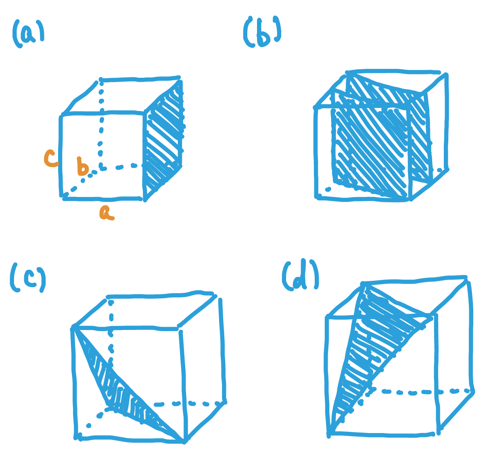

## 3-1
If A and C are centered, then $(\frac{1}{2}, \frac{1}{2}, 0)$ and $(1, \frac{1}{2}, \frac{1}{2})$ are lattice points. 
Therefore, $(\frac{1}{2}, 0, \frac{1}{2})$ is also a lattice point, i.e., B is centered.
Then the crystal can be seen as body-centered monoclinic, which is reduced to C-centered monoclinic.

## 3-2
A B-centered monoclinic can always be reduced to a monoclinic with primitive cells.
The size of the reduced primitive cell is half that of the unit cell of the B-centered monoclinic.

## 3-3
If an orthorhombic is I-, A-, B-, and C-centered at the same time, it follows that the midpoint of each edge of the unit cell is a lattice point.
Therefore, the crystal can be seen as an orthorhombic with a primitive unit cell 1/8 the size of the original unit cell.

## 3-4
If a tetragonal is A-centered, it is also B- and C-centered.
Then, the crystal can be viewed as a body-centered tetragonal with a unit cell half the size of the original unit cell.

## 3-5
### (a)
$V = 5^3 \times \sqrt{1+2\cos^3(75^\circ)-3\cos^2(75^\circ)} \fallingdotseq 114.13[Å^3]$

### (b)
$a = b = 5 \times \sin((75/2)^\circ) \times 2 \fallingdotseq 6.09[Å]$

$c= 3 \times \sqrt{25 - \frac{1}{3}a^2} \fallingdotseq 10.66[Å]$

### (c)
$V' = a \times b \times \sin(120^\circ) \times c \fallingdotseq 342.54[Å^3]$

$\frac{V'}{V} \fallingdotseq 3$

## 3-6
A rhombohedral unit can be embedded into the unit cell of a face-centered cubic:
in the cubic, $(0, \frac{1}{2}, \frac{1}{2}), (\frac{1}{2}, 0, \frac{1}{2}), (\frac{1}{2}, \frac{1}{2}, 0)$ are the axes of the thombohedral unit.
The edge length of the cube is $6\sqrt{2}$.
Whether the given crystal belongs to a rhombohedral or cubic depends on the symmetry is satisfies.

## 3-7
### (a)
$(4, 3, 2)$

### (b)
$(0, 2, 5)$

### (c)
$(3, 0, 12)$

### (d)
$(6, 5, 0)$

### (e)
$(6, 5, 0)$

## 3-8

## 3-9
### (a)
$\frac{1}{d} = \frac{[h^2b^2c^2 + k^2a^2c^2\sin^2\beta + l^2a^2b^2 + 2hlab^2c(-\cos\beta)]^\frac{1}{2}}{abc(1-\cos^2\beta)^\frac{1}{2}} = [(\frac{h}{a\sin\beta})^2 + (\frac{k}{b})^2 + (\frac{l}{c\sin\beta})^2 - \frac{2hl(\cos\beta)}{ac\sin^2\beta}]^\frac{1}{2}$

### (b)
$\frac{1}{d} = \frac{[h^2a^2c^2 + k^2a^2c^2 + l^2a^4\frac{3}{4} + 2hla^3c\frac{1}{2}]^\frac{1}{2}}{a^2c(1-\frac{1}{4})^\frac{1}{2}} = [\frac{4}{3}(\frac{h}{a})^2 + \frac{4}{3}(\frac{k}{a})^2 + (\frac{l}{c})^2 + \frac{4}{3}\frac{hl}{ac}]^\frac{1}{2}$

### (c)
$\frac{1}{d} = \frac{[(h^2 + k^2 + l^2)a^4\sin^2\alpha + 2(hl + hk + kl)a^4(\cos^2\alpha - \cos\alpha)]^\frac{1}{2}}{a^3(1-3\cos^2\alpha+2\cos^3\alpha)^\frac{1}{2}} = \frac{[(h^2 + k^2 + l^2)\sin^2\alpha + 2(hl + hk + kl)(\cos^2\alpha - \cos\alpha)]^\frac{1}{2}}{a(1-3\cos^2\alpha+2\cos^3\alpha)^\frac{1}{2}}$

## 3-10

$8 \times 5 \times \sin(115^\circ) = d \times \sqrt{8^2 + 5^2 - 2 \times 8 \times 5 \times \cos 115^\circ}$ leads to $d \fallingdotseq 3.27[Å]$

$d = [(\frac{h}{a\sin\beta})^2 + (\frac{l}{c\sin\beta})^2 - \frac{2hl(\cos\beta)}{ac\sin^2\beta}]^{-\frac{1}{2}} \fallingdotseq 3.27[Å]$

## 3-11
$8 \times 5 \times \sin(65^\circ) = d \times \sqrt{8^2 + 5^2 - 2 \times 8 \times 5 \times \cos 65^\circ}$ leads to $d \fallingdotseq 4.88[Å]$

$d = [(\frac{h}{a\sin\beta})^2 + (\frac{l}{c\sin\beta})^2 - \frac{2hl(\cos\beta)}{ac\sin^2\beta}]^{-\frac{1}{2}} \fallingdotseq 4.88[Å]$
