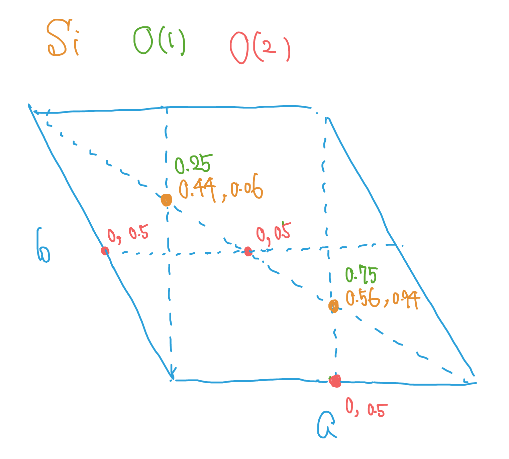

## 4-1
The distance between Pd(1) and any of the four neighboring Ss is:

$$
\begin{aligned}
    \sqrt{(0.19a)^2 + (0.32a)^2 + (0.02c)^2} \fallingdotseq 2.396 [Å].
\end{aligned}
$$

The distance between Pd(2) and any of the four neighboring Ss is:

$$
\begin{aligned}
    \sqrt{(0.19a)^2 + (0.18a)^2 + (0.23c)^2} \fallingdotseq 2.267 [Å].
\end{aligned}
$$

The distances between Pd(3) and four neighboring Ss are:

$$
\begin{aligned}
    \text{The closer two}:& \sqrt{(0.20a)^2 + (0.06a)^2 + (0.27c)^2} \fallingdotseq 2.233 [Å],\\
    \text{The other two}:& \sqrt{(0.29a)^2 + (0.07a)^2 + (0.23c)^2} \fallingdotseq 2.447 [Å].
\end{aligned}
$$

The distances between S and four neighboring Pbs:

$$
\begin{aligned}
    \text{Pd(1)}:& \fallingdotseq 2.396 [Å],\\
    \text{Pd(2)}:& \fallingdotseq 2.267 [Å],\\
    \text{Pd(3)}:& \fallingdotseq 2.233, 2.447 [Å].
\end{aligned}
$$

## 4-2
Hg is in an octahedron of Br.

$$
\begin{aligned}
    \text{Br(1)}:& \sqrt{(0a)^2 + (0.132b)^2 + (0.278c)^2} \fallingdotseq 2.504 [Å],\\
    \text{Br(1)} \times 2:& \sqrt{(0.5a)^2 + (0.132b)^2 + (0.222c)^2} \fallingdotseq 2.700 [Å],\\
    \text{Br(2)}:& \sqrt{(0a)^2 + (0.132b)^2 + (0.277c)^2} \fallingdotseq 2.499 [Å],\\
    \text{Br(2)} \times 2:& \sqrt{(0.5a)^2 + (0.132b)^2 + (0.223c)^2} \fallingdotseq 2.703 [Å].
\end{aligned}
$$

$(0, 0.368, 0.389)$, $(0, 0.5, 0.666)$ and $(0, 0.632, 0.944)$ are almost on the same line, so $180^\circ$.

## 4-3
$Pmc2_1$ has the following symmetries: a reflection w.r.t. a mirror perpendicular to $a$, a glide along $c$ axis with a mirror perpendicular to $b$, and a screw $2_1$ along $c$ axis.

General positions: $(x, y, z), (-x, y, z), (-x, -y, z+\frac{1}{2}), (x, -y, z+\frac{1}{2})$.

Special positions: $(0, y, z), (0, -y, z+\frac{1}{2})$.

## 4-4
$P312$ has the following symmetries: a threefold rotation axis along c and two twofold rotation axes on the ab-plane (not parallel to axes a and b).

General positions: $(x, y, z), (-y, x-y, z), (-x+y, -x, z), (x, x-y, -z), (-y, -x, -z), (-x+y, y, -z)$.

Special positions: $(0, 0, z), (0, 0, -z)$.

Other threefold axes: $(x, y) = (\frac{1}{3}, \frac{2}{3}), (\frac{2}{3}, \frac{1}{3})$

## 4-5

$$
\begin{aligned}
    \text{O(0.454)}:& \sqrt{((0.535-0.272)\frac{\sqrt{3}}{2}a)^2 + (((0.535-0.420) - (0.535-0.272)\frac{1}{2})b)^2 + ((0.667-0.454)c)^2} \fallingdotseq 1.608 [Å],\\
    \text{O(0.879)}:& \sqrt{((0.535-0.420)\frac{\sqrt{3}}{2}a)^2 + (((0.535-0.272) - (0.535-0.420)\frac{1}{2})b)^2 + ((0.667-0.879)c)^2} \fallingdotseq 1.604 [Å],\\
    \text{O(0.546)}:& \sqrt{((0.535-0.852)\frac{\sqrt{3}}{2}a)^2 + (((0.535-0.580) - (0.535-0.852)\frac{1}{2})b)^2 + ((0.667-0.546)c)^2} \fallingdotseq 1.599 [Å],\\
    \text{O(0.787)}:& \sqrt{((0.535-0.580)\frac{\sqrt{3}}{2}a)^2 + (((0.535-0.852) - (0.535-0.580)\frac{1}{2})b)^2 + ((0.667-0.787)c)^2} \fallingdotseq 1.597 [Å].
\end{aligned}
$$

## 4-6

$$
\begin{aligned}
    \text{bond length}:& \sqrt{(0a)^2 + (0.20b)^2 + (0.24c)^2} \fallingdotseq 1.971 [Å],\\
    \text{four neighbors}:& \sqrt{(0.5a)^2 + (0b)^2 + (0.5c)^2} \fallingdotseq 3.841 [Å],\\
    \text{two neighbors}:& \sqrt{(0.5a)^2 + (0.3b)^2} \fallingdotseq 3.984 [Å],\\
    \text{two neighbors}:& \sqrt{(0a)^2 + (0.3b)^2 + (0.5c)^2} \fallingdotseq 3.340 [Å],\\
    \text{two neighbors}:& \sqrt{(0.5a)^2 + (0.2b)^2 + (0.26c)^2} \fallingdotseq 3.718 [Å].
\end{aligned}
$$

## 4-7
### (a)

### (b)
Si: $C_{3v}$

O(1): $D_{3h}$

O(2): $C_{2h}$

### (c)

$$
\begin{aligned}
    \text{O(1)}:& 8.22 \times 0.19 \fallingdotseq 1.562 [Å],\\
    \text{O(2)} \times 3:& \sqrt{(\frac{\sqrt{3}}{6}a)^2 + (0.06c)^2} \fallingdotseq 1.534 [Å].
\end{aligned}
$$

## 4-8
$(0, 0, 0) \pm (x, y, z)$, $(0, 0, 0) \pm (x, -y, z+\frac{1}{2})$, $(\frac{1}{2}, \frac{1}{2}, 0) \pm (x, y, z)$, $(\frac{1}{2}, \frac{1}{2}, 0) \pm (x, -y, z+\frac{1}{2})$
